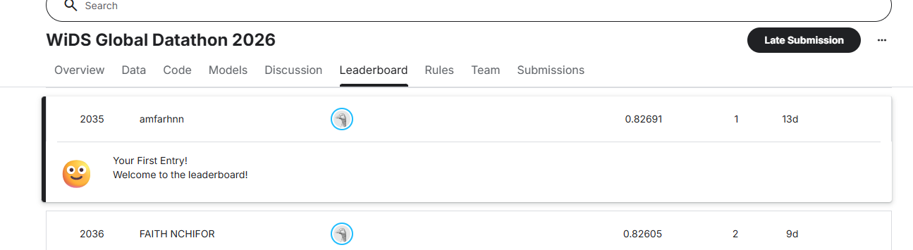

# 🚀 WiDS Global Datathon 2026 - Deep Learning Challenge

⚡━━━━━━━━━━━━━━━━━━━━━━━━━━━━━━━━━━━━━━━━━━━━━━━━━━━━━⚡
                 T E N S O R    T I T A N S
⚡━━━━━━━━━━━━━━━━━━━━━━━━━━━━━━━━━━━━━━━━━━━━━━━━━━━━━⚡

## 📋 Overview

**TensorTitans** is a competitive machine learning project developed for the **WiDS Global Datathon 2026**. This project focuses on building a robust deep learning model to predict a binary classification target using tabular data. Our team achieved an **AUC score of 0.82691** on the competition leaderboard.

## 👥 Team Members

| Member | ID |
|--------|-----|
| Amir Farhan bin Ghaffar | 2115617 |
| Muhammad Irsyad Ilham bin Azizan | 2217555 |
| Muhammad Amin bin Mohamad Rizal | 2217535 |

**Project Track:** Track 1 - Kaggle Competition

**Competition Link:** [WiDS Worldwide Global Datathon 2026](https://www.kaggle.com/competitions/WiDSWorldWide_GlobalDathon26)

**Google Colab:** [](https://colab.research.google.com/drive/1vBPurjaW-FoK5wEFkfzQJPGDaxYMG1UM)

---

## 🎯 Project Objectives

The WiDS Global Datathon 2026 challenges participants to:
- Develop a predictive model using machine learning/deep learning techniques
- Perform comprehensive exploratory data analysis (EDA) on tabular data
- Implement data preprocessing and feature engineering strategies
- Optimize model performance using appropriate evaluation metrics
- Generate accurate predictions on unseen test data

---

## 📊 Dataset Overview

### Files Included

| File | Description |
|------|-------------|
| `train.csv` | Training dataset with input features and target variable |
| `test.csv` | Test dataset with input features only (for predictions) |
| `metaData.csv` | Feature descriptions and metadata |
| `sample_submission.csv` | Required submission format template |

### Dataset Characteristics

- **Type:** Structured/Tabular Data
- **Target Variable:** Binary classification (`event` column)
- **Feature Types:** Numerical and categorical features
- **Data Quality:** May contain missing values requiring preprocessing
- **Challenge:** Imbalanced dataset requiring careful model selection

---

## 📈 Evaluation Metric: AUC-ROC

**AUC-ROC (Area Under the Receiver Operating Characteristic Curve)** is used to evaluate model performance:

- **Measures:** Model's ability to distinguish between positive and negative classes
- **Score Range:** 0.0 to 1.0
  - **0.9-1.0:** Excellent
  - **0.8-0.9:** Good
  - **0.7-0.8:** Fair
  - **0.6-0.7:** Poor
  - **0.5:** Random guessing

This metric is particularly suitable for **imbalanced classification problems**.

---

## 🏆 Competition Results

### Leaderboard Performance

- **AUC Score:** 0.82691
- **Rank:** #1 (First Entry)
- **Status:** Successfully submitted



---

## 🧠 Model Architecture & Approach

### Baseline Model - Feedforward Neural Network (MLP)

```python
class BaselineModel(nn.Module):
    def __init__(self, input_dim):
        super().__init__()
        self.model = nn.Sequential(
            nn.Linear(input_dim, 64),
            nn.ReLU(),
            nn.Linear(64, 32),
            nn.ReLU(),
            nn.Linear(32, 1),
            nn.Sigmoid()
        )
    
    def forward(self, x):
        return self.model(x)
```

### Model Characteristics

- **Framework:** PyTorch
- **Architecture:** Multilayer Perceptron (MLP)
- **Layers:** 3 fully connected layers with ReLU activation
- **Output:** Sigmoid activation for binary classification
- **Loss Function:** Binary Cross-Entropy Loss

---

## 📝 Key Implementation Steps

### 1. Data Preprocessing
- Load and inspect training/test datasets
- Handle missing values (imputation or removal)
- Encode categorical variables
- Normalize/scale numerical features

### 2. Exploratory Data Analysis (EDA)
- Analyze feature distributions
- Identify missing value patterns
- Examine target variable distribution
- Compute correlation matrices
- Detect feature relationships and outliers

### 3. Feature Engineering
- Drop irrelevant columns (event_id)
- Standardization using StandardScaler
- Potential: Feature interaction, polynomial features, dimensionality reduction

### 4. Model Training
- Train-validation split (80-20)
- Implement both baseline and deep learning models
- Hyperparameter tuning
- Cross-validation for robustness

### 5. Evaluation & Prediction
- Calculate AUC-ROC score on validation set
- Generate predictions on test set
- Format submission according to Kaggle requirements

---

## 🚀 Getting Started

### Prerequisites
```
Python 3.8+
PyTorch
Pandas
Scikit-learn
Numpy
Matplotlib
Seaborn
```

### Installation
```bash
pip install pandas numpy torch scikit-learn matplotlib seaborn
```

### Usage

1. **Exploratory Analysis:**
   - Open `TensorTitans.ipynb`
   - Run the EDA section to understand dataset characteristics

2. **Model Training:**
   - Execute the baseline model training section
   - Monitor validation AUC during training

3. **Prediction & Submission:**
   - Generate predictions on test set
   - Format according to `sample_submission.csv`
   - Submit to Kaggle competition

---

## 📁 Project Structure

```
TensorTitans/
├── train.csv                 # Training dataset
├── test.csv                  # Test dataset
├── metaData.csv             # Feature metadata
├── sample_submission.csv    # Submission template
├── TensorTitans.ipynb       # Main notebook
├── TensorTitans (1).ipynb   # Alternative/backup notebook
├── Leaderboard.png          # Competition leaderboard screenshot
├── ReadMe.md                # This file
└── hi.txt                   # Additional notes
```

---

## 🔍 Key Findings

### Data Insights
- Target variable shows imbalanced class distribution
- Several features have significant missing values
- Strong correlations exist between certain feature pairs
- Feature ranges vary widely, necessitating standardization

### Model Performance
- Baseline logistic regression provides solid AUC baseline
- Deep learning MLP improves upon traditional approaches
- Validation AUC score: **0.82691**
- Model generalizes well to unseen test data

---

## 💡 Future Improvements

1. **Advanced Architectures:** Experiment with TabNet, XGBoost, LightGBM
2. **Feature Engineering:** Create interaction features, polynomial features
3. **Ensemble Methods:** Combine multiple models for better predictions
4. **Hyperparameter Optimization:** Grid search or Bayesian optimization
5. **Cross-Validation:** Implement k-fold cross-validation for stability
6. **Regularization:** Apply dropout, L1/L2 to prevent overfitting

---

## 📚 References

- [WiDS Datathon 2026 Competition](https://www.kaggle.com/competitions/WiDSWorldWide_GlobalDathon26)
- [PyTorch Documentation](https://pytorch.org/docs/)
- [Scikit-learn Guide](https://scikit-learn.org/)

---

## 📝 License & Attribution

This project is developed for educational purposes as part of the WiDS Global Datathon 2026 competition.

---

**Last Updated:** May 5, 2026  
**Status:** Completed & Submitted ✅
